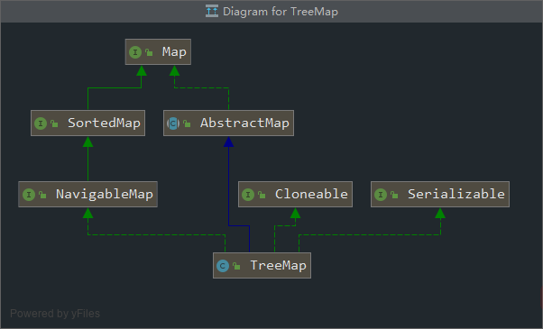

## （一）JAVA SE — 集合

[TOC]


### 1. Queue

   

 

#### 每一种队列的实现方式、使用场景、缺点？

#### 1.1 BlockingQueue[阻塞队列]

##### 1.1.1 ArrayBlockingQueue

`reentrantLock` + `Object[]` + `Conditon`

**有界队列 + 锁** 

+ **基本要素**

```java
    /** Main lock guarding all access */
    final ReentrantLock lock;

    /** Condition for waiting takes */
    private final Condition notEmpty;

    /** Condition for waiting puts */
    private final Condition notFull;

    //fair= false   非公平锁 + Condition + 数组
    public ArrayBlockingQueue(int capacity, boolean fair) {
        if (capacity <= 0)
            throw new IllegalArgumentException();
        this.items = new Object[capacity];
        lock = new ReentrantLock(fair);
        notEmpty = lock.newCondition();
        notFull =  lock.newCondition();
    }
```

+ **添加元素**

```java
//add()直接调用父类的方法，添加失败抛出异常
   public boolean add(E e) {
        if (offer(e))
            return true;
        else
            throw new IllegalStateException("Queue full");
    }

//offer() 添加失败会 return false
    public boolean offer(E e) {
        //判断添加元素是否为空
        checkNotNull(e);
        //加锁
        final ReentrantLock lock = this.lock;
        lock.lock();
        try {
            //已满
            if (count == items.length)
                return false;
            else {
                //入队列
                enqueue(e);
                return true;
            }
        } finally {
            //释放锁
            lock.unlock();
        }
    }
//put()  一直阻塞
    public void put(E e) throws InterruptedException {
        checkNotNull(e);
        final ReentrantLock lock = this.lock;
        //如果线程中断，会抛出异常InterruptedException
        lock.lockInterruptibly();
        try {
            //阻塞等待-----
            while (count == items.length)
                notFull.await();
            enqueue(e);
        } finally {
            lock.unlock();
        }
    }

//offer(long timeout)  阻塞一定的时间如果还没入队列，return false
    public boolean offer(E e, long timeout, TimeUnit unit)
        throws InterruptedException {

        checkNotNull(e);
        long nanos = unit.toNanos(timeout);
        final ReentrantLock lock = this.lock;
        lock.lockInterruptibly();
        try {
            while (count == items.length) {
                if (nanos <= 0)
                    return false;
                nanos = notFull.awaitNanos(nanos);
            }
            enqueue(e);
            return true;
        } finally {
            lock.unlock();
        }
    }

```

+ **删除元素**

```java
public E remove() {
    // 调用poll()方法出队
    E x = poll();
    if (x != null)
        // 如果有元素出队就返回这个元素
        return x;
    else
        // 如果没有元素出队就抛出异常
        throw new NoSuchElementException();
}

public E poll() {
    final ReentrantLock lock = this.lock;
    // 加锁
    lock.lock();
    try {
        // 如果队列没有元素则返回null，否则出队
        return (count == 0) ? null : dequeue();
    } finally {
        lock.unlock();
    }
}

public E take() throws InterruptedException {
    final ReentrantLock lock = this.lock;
    // 加锁
    lock.lockInterruptibly();
    try {
        // 如果队列无元素，则阻塞等待在条件notEmpty上
        while (count == 0)
            notEmpty.await();
        // 有元素了再出队
        return dequeue();
    } finally {
        // 解锁
        lock.unlock();
    }
}

public E poll(long timeout, TimeUnit unit) throws InterruptedException {
    long nanos = unit.toNanos(timeout);
    final ReentrantLock lock = this.lock;
    // 加锁
    lock.lockInterruptibly();
    try {
        // 如果队列无元素，则阻塞等待nanos纳秒
        // 如果下一次这个线程获得了锁但队列依然无元素且已超时就返回null
        while (count == 0) {
            if (nanos <= 0)
                return null;
            nanos = notEmpty.awaitNanos(nanos);
        }
        return dequeue();
    } finally {
        lock.unlock();
    }
}

```


+ **入队 && 出队**

```java
//出队的时候同步更新迭代器的状态 
transient Itrs itrs = null;

//循环队列    
private void enqueue(E x) {
        // assert lock.getHoldCount() == 1;
        // assert items[putIndex] == null;
        final Object[] items = this.items;
        items[putIndex] = x;
        if (++putIndex == items.length)
            putIndex = 0;
        count++;
        notEmpty.signal();
    }

private E dequeue() {
        // assert lock.getHoldCount() == 1;
        // assert items[takeIndex] != null;
        final Object[] items = this.items;
    //告诉编译器忽略 unchecked 警告信息，如使用List，ArrayList等未进行参数化产生的警告信息。
        @SuppressWarnings("unchecked")
        E x = (E) items[takeIndex];
        items[takeIndex] = null;
        if (++takeIndex == items.length)
            takeIndex = 0;
        count--;
        if (itrs != null)
            itrs.elementDequeued();
        notFull.signal();
        return x;
    }
```

##### 1.1.2 LinkedBlockingQueue

1. 带有头节点的单链表，有头节点和尾节点两个。`head`  `last`。

2. 有两把锁。`takeLock`  `putLock`。

3. **AtomicInteger** count = new AtomicInteger(); 

4. 默认的无参构造长度是`Integer.MAX_VALUE`。

   ```java
       /** Lock held by take, poll, etc */
       private final ReentrantLock takeLock = new ReentrantLock();
   
       /** Wait queue for waiting takes */
       private final Condition notEmpty = takeLock.newCondition();
   
       /** Lock held by put, offer, etc */
       private final ReentrantLock putLock = new ReentrantLock();
   
       /** Wait queue for waiting puts */
       private final Condition notFull = putLock.newCondition();
   
       public LinkedBlockingDeque() {   
       this(Integer.MAX_VALUE);
       }
   
   ```


+ put()---阻塞

```java
public void put(E e) throws InterruptedException {
        if (e == null) throw new NullPointerException();
        //规定给当前put方法预留一个本地变量
        int c = -1;
        Node<E> node = new Node<E>(e);
        final ReentrantLock putLock = this.putLock;
        final AtomicInteger count = this.count;
        putLock.lockInterruptibly();
        try {
            //队列满了，进入阻塞状态
            while (count.get() == capacity) {
                notFull.await();
            }
            //正常入队
            enqueue(node);
            //count.getAndIncrement()返回修改之前的c，就是count通过CAS操作已经+1了
            //但是返回的还是之前的节点数
            c = count.getAndIncrement();
            if (c + 1 < capacity)
                notFull.signal();
        } finally {
            putLock.unlock();
        }
        //当入队前的节点数是0时，可能线程阻塞在take()方法
        //唤醒一个
        if (c == 0)
            signalNotEmpty();
    }
```

+ offer()

  **offer(E e,long timeout, TimeUnit unit)：**在队尾插入一个元素，超时则不尝试，支持获取锁时中断。当前节点入队后，如果队列没满，就唤醒一个入队的线程让其入队。

+ take() && poll()

  `take()`  阻塞

​       `poll()` 非阻塞。

##### 1.1.3 PriorityBlockingQueue

具有优先级的有界队列, 底层数据结构：`heap`。

```java
//自旋锁变量  
private transient volatile int allocationSpinLock;
```

+ 扩容

  **cas 控制只有一个线程可以扩容成功**

```java
    private void tryGrow(Object[] array, int oldCap) {
    lock.unlock(); //释放获取的锁
    Object[] newArray = null;

    //cas成功则扩容(4)
    if (allocationSpinLock == 0 &&
        UNSAFE.compareAndSwapInt(this, allocationSpinLockOffset,
                                 0, 1)) {
        try {
            //oldGap<64则扩容新增oldcap+2,否者扩容50%，并且最大为MAX_ARRAY_SIZE
            int newCap = oldCap + ((oldCap < 64) ?
                                   (oldCap + 2) : // 如果一开始容量很小，则扩容宽度变大
                                   (oldCap >> 1));
            if (newCap - MAX_ARRAY_SIZE > 0) {    // 可能溢出
                int minCap = oldCap + 1;
                if (minCap < 0 || minCap > MAX_ARRAY_SIZE)
                    throw new OutOfMemoryError();
                newCap = MAX_ARRAY_SIZE;
            }
            if (newCap > oldCap && queue == array)
                newArray = new Object[newCap];
        } finally {
            allocationSpinLock = 0;
        }
    }

    //第一个线程cas成功后，第二个线程会进入这个地方，然后第二个线程让出cpu，尽量让第一个线程执行下面点获取锁，但是这得不到肯定的保证。(5)
    if (newArray == null) // 如果两外一个线程正在分配，则让出
        Thread.yield();
    lock.lock();//(6)
    if (newArray != null && queue == array) {
        queue = newArray;
        System.arraycopy(array, 0, newArray, 0, oldCap);
    }
}
```


##### 1.1.4 SynchronousQueue

内部不能存储数据。每一次的`take()`都会阻塞到一次`put()`,反之亦然。

```java
   public SynchronousQueue(boolean fair) {
       //使用队列或者是栈，都是使用单链表来实现的
        transferer = fair ? new TransferQueue<E>() : new TransferStack<E>();
    }
```

##### 1.1.5 delayQueue

可以指定添加的元素才一定时间后才能被访问。

**使用场景**：

+ 缓存设计。保存缓存元素的有效期。
+ 定时任务调度。保存要执行的任务和时间。

#### 1.2 AbstractQueue[非阻塞队列]

##### 1.2.1 PriorityQueue

##### 1.2.2 ConcurrentLinkedQueue

ConcurrentLinkedQueue是如何实现线程安全的操作？

+ **入队列**

  > 添加元素以后，需要判断`newNode`和`tail`是不是指向同一个结点。

  1. 添加到尾结点
  2. 更新`tail`。`tail.next == null`,则 `tail.next = newNode`,否则 `tail = newNode`. 

```java
 public boolean offer(E e) {
   // 0.这里是检查入队列前要插入的节点是不是为空
        checkNotNull(e);
       // 1. 这是入队前，先创建一个入队节点
        final Node<E> newNode = new Node<E>(e);
		//2. 这里是一个死循环，如果入队不成功继续尝试入队
        for (Node<E> t = tail, p = t;;) {
        //3.这里是判断尾节点给q，然后进行判空
            Node<E> q = p.next;
            if (q == null) {
                // 4. p表示尾节点，下面这句表示看尾节点的下一个节点是不是为空，
//casNext就表示P的下一个节点如果为空，就新建一个节点给尾节点的下一个节点（这个节点就是要入队的新节点），如果不为空，就不用管（说明已经有节点了）
                if (p.casNext(null, newNode)) {
//5.这个是判断尾节点和tail节点是不是指向的是同一个节点，这个是更新tail节点
                    if (p != t) // hop two nodes at a time
                        casTail(t, newNode);  // Failure is OK.
                    return true;
                }
            }
            //(这里其实又是另外一种场景)说明p指向的节点的next也指向它自己，这种节点称之为哨兵节点，这种节点在队列中存在的价值不大，一般表示为要删除的节点或者是空节点
            else if (p == q)
            
                p = (t != (t = tail)) ? t : head;
            else
                // Check for tail updates after two hops.
                p = (p != t && t != (t = tail)) ? t : q;
        }
    }


```

+ **出队列**

  如果`head == null`,更新`head`, 否则，直接`head`出队列。为了减少使用CAS更新head节点的消耗。

#### 1.3 Deque[双端队列]


### 2. List

---

#### 2.1 ArrayList

##### 基本原理

```java
//从继承的接口就可以看出，随机访问特性，可clone，序列化
public class ArrayList<E> extends AbstractList<E>
        implements List<E>, RandomAccess, Cloneable, java.io.Serializable{
    // 默认长度 = 10   
    private static final int DEFAULT_CAPACITY = 10;
    private static final Object[] EMPTY_ELEMENTDATA = {};
    private static final Object[] DEFAULTCAPACITY_EMPTY_ELEMENTDATA = {};
    
    //空构造函数 
    public ArrayList() {
        this.elementData = DEFAULTCAPACITY_EMPTY_ELEMENTDATA;
    }   
}
    
```

##### 扩容机制

```java
public boolean add(E e) {
    ensureCapacityInternal(size + 1);  // Increments modCount!!
    elementData[size++] = e;
    return true;
}
 /**
  *当添加第一个元素的时候，minCapacity=1,DEFAULT_CAPACITY=10;
  * return 10;
  */
private void ensureCapacityInternal(int minCapacity) {
    if (elementData == DEFAULTCAPACITY_EMPTY_ELEMENTDATA) {
        //得到最小容量
        minCapacity = Math.max(DEFAULT_CAPACITY, minCapacity);
    }
    ensureExplicitCapacity(minCapacity);
}

private void ensureExplicitCapacity(int minCapacity) {
    //操作次数,仅记录结构发生改变的次数，更改和查询不计数
    modCount++;
    // overflow-conscious code
    if (minCapacity - elementData.length > 0)
        //扩容
        grow(minCapacity);
}

private void grow(int minCapacity) {
    // overflow-conscious code
    int oldCapacity = elementData.length;
    //右移一位 + oldCapacity
    int newCapacity = oldCapacity + (oldCapacity >> 1);
    if (newCapacity - minCapacity < 0)
        newCapacity = minCapacity;
    if (newCapacity - MAX_ARRAY_SIZE > 0)
        newCapacity = hugeCapacity(minCapacity);
    // minCapacity is usually close to size, so this is a win:
    elementData = Arrays.copyOf(elementData, newCapacity);
}

    private static int hugeCapacity(int minCapacity) {
        if (minCapacity < 0) // overflow
            throw new OutOfMemoryError();
       //private static final int MAX_ARRAY_SIZE = Integer.MAX_VALUE - 8;
        return (minCapacity > MAX_ARRAY_SIZE) ?
            Integer.MAX_VALUE :
            MAX_ARRAY_SIZE;
    }


```

##### 删除

```java
    public E remove(int index) {
        rangeCheck(index);

        modCount++;
        E oldValue = elementData(index);

        int numMoved = size - index - 1;
        if (numMoved > 0)
            //复制
            System.arraycopy(elementData, index+1, elementData, index,
                             numMoved);
        elementData[--size] = null; // clear to let GC do its work

        return oldValue;
    }
```

##### 确认容量大小

```java
    public void ensureCapacity(int minCapacity) {
        int minExpand = (elementData != DEFAULTCAPACITY_EMPTY_ELEMENTDATA)
            // any size if not default element table
            ? 0
            // larger than default for default empty table. It's already
            // supposed to be at default size.
            : DEFAULT_CAPACITY;
        
		//相当于是预估空间大小，避免多次扩容
        if (minCapacity > minExpand) {
            ensureExplicitCapacity(minCapacity);
        }
    }
```

##### 序列化

保存元素的数组 elementData 使用 transient 修饰，该关键字声明数组默认不会被序列化。

```java
transient Object[] elementData; // non-private to simplify nested class access
```

```java
  //序列化与反序列化 ObjectInputStream /ObjectOutPutStream
 ArrayList<String> arrayList = new ArrayList();
 arrayList.add("hello ");
 arrayList.add("world");
 ObjectOutputStream os = new ObjectOutputStream(new FileOutputStream("hello world"));
 os.writeObject(arrayList);

 ObjectInputStream is = new ObjectInputStream(new FileInputStream("hello world"));
 System.out.println(is.readObject());
```


**:/动态数组和静态数组的区别？**

-- 动态数组是在使用的时候才分配大小，而且可以动态扩容。

---

#### 2.2 Vector

##### 基本原理

```java
 protected Object[] elementData;   
//初始化
    public Vector() {
        this(10);
    }
//加锁
public synchronized void addElement(E obj) {
        modCount++;
        ensureCapacityHelper(elementCount + 1);
        elementData[elementCount++] = obj;
    }
```

##### 扩容

```java
    private void grow(int minCapacity) {
        // overflow-conscious code
        int oldCapacity = elementData.length;
        int newCapacity = oldCapacity + ((capacityIncrement > 0) ?
                                         capacityIncrement : oldCapacity);
        if (newCapacity - minCapacity < 0)
            newCapacity = minCapacity;
        if (newCapacity - MAX_ARRAY_SIZE > 0)
            newCapacity = hugeCapacity(minCapacity);
        elementData = Arrays.copyOf(elementData, newCapacity);
    }
```

##### Vector VS ArrayList

+ Vector是线程安全的；
+ Vector的扩容默认是2倍(capacityIncrement=0)。ArrayLIst是1.5倍。

##### 其他同步容器

`CopyOnWriteArrayList`  

**底层实现：**ReentrantLock +`读写分离`

```java
    public boolean add(E e) {
        final ReentrantLock lock = this.lock;
        lock.lock();
        try {
            Object[] elements = getArray();
            int len = elements.length;
            Object[] newElements = Arrays.copyOf(elements, len + 1);
            newElements[len] = e;
            setArray(newElements);
            return true;
        } finally {
            lock.unlock();
        }
    }

//修改引用地址
final void setArray(Object[] a) {
    array = a;
}
```

```java
//抑制单类型的警告
@SuppressWarnings("unchecked")
private E get(Object[] a, int index) {
    return (E) a[index];
}
```

##### 应用场景

适合读取多写少的场景；

**不足**

1. 添加元素的时候复制了一份新的数组，比较占用空间；
2. 可能写的操作还没完成，所以读取的数据还是之前的数据。


#### 2.3 LinkedList

##### 基本结构

带有`first` & `last` 的`双链表` 

```java
private static class Node<E> {
    E item;
    Node<E> next;
    Node<E> prev;
}

transient Node<E> first;
transient Node<E> last;

```

#### 2.4 CopyOnWriteArrayList

读写分离

```java
    public E set(int index, E element) {
        //修改的时候需要加锁
        final ReentrantLock lock = this.lock;
        lock.lock();
        try {
            Object[] elements = getArray();
            E oldValue = get(elements, index);

            if (oldValue != element) {
                int len = elements.length;
                Object[] newElements = Arrays.copyOf(elements, len);
                newElements[index] = element;
                setArray(newElements);
            } else {
                // Not quite a no-op; ensures volatile write semantics
                setArray(elements);
            }
            return oldValue;
        } finally {
            lock.unlock();
        }
    }
```

```java
   public E get(int index) {
       //读取的时候不需要加锁
        return get(getArray(), index);
    }

```

#### 2.5 Collections.SynchronizedList

对传入的`list`加锁

```java
       SynchronizedList(List<E> list) {
            super(list);
            this.list = list;
        }

	   SynchronizedCollection(Collection<E> c) {
            this.c = Objects.requireNonNull(c);
           //对list加锁
            mutex = this;
        }

```


### 3. Map

都是用的`懒加载`，使用的时候初始化。


#### 1. 王者角色-hashMap

##### 重要参数

```java
static final int DEFAULT_INITIAL_CAPACITY = 1 << 4;;

static final int MAXIMUM_CAPACITY = 1 << 30;

static final float DEFAULT_LOAD_FACTOR = 0.75f;

//一个桶存储的链表长度大于等于 8 时会将链表转换为红黑树。
static final int TREEIFY_THRESHOLD = 8;
//红黑树-> 链表
static final int UNTREEIFY_THRESHOLD = 6;
//最小树形化阈值
static final int MIN_TREEIFY_CAPACITY = 64;
```

**扩容机制**

1. 申请空间
2. `rehash` + 复制元素

```java
    final V putVal(int hash, K key, V value, boolean onlyIfAbsent,
                   boolean evict) {
        Node<K,V>[] tab; Node<K,V> p; int n, i;
        if ((tab = table) == null || (n = tab.length) == 0)
            n = (tab = resize()).length;
        if ((p = tab[i = (n - 1) & hash]) == null)
            tab[i] = newNode(hash, key, value, null);
        else {
            Node<K,V> e; K k;
            if (p.hash == hash &&
                ((k = p.key) == key || (key != null && key.equals(k))))
                e = p;
            else if (p instanceof TreeNode)
                e = ((TreeNode<K,V>)p).putTreeVal(this, tab, hash, key, value);
            else {
                for (int binCount = 0; ; ++binCount) {
                    if ((e = p.next) == null) {
                        p.next = newNode(hash, key, value, null);
                        if (binCount >= TREEIFY_THRESHOLD - 1) // -1 for 1st
                            treeifyBin(tab, hash);
                        break;
                    }
                    if (e.hash == hash &&
                        ((k = e.key) == key || (key != null && key.equals(k))))
                        break;
                    p = e;
                }
            }
            if (e != null) { // existing mapping for key
                V oldValue = e.value;
                if (!onlyIfAbsent || oldValue == null)
                    e.value = value;
                afterNodeAccess(e);
                return oldValue;
            }
        }
        ++modCount;
        if (++size > threshold)
            resize();
        afterNodeInsertion(evict);
        return null;
    }
index = (n-1) & hash;
```


**key(hashcode)-->hash-->indexFor-->最终索引位置**

```java
    static final int hash(Object key) {
        int h;
        //扩展高位hash值，避免冲突
        return (key == null) ? 0 : (h = key.hashCode()) ^ (h >>> 16);
    }

```


#### 2. 星耀角色-courrentHashMap

`弱一致性`： 因为`get()`和`contains()`方法都没有加锁。

##### 基本原理

`Node+链表+红黑树`

`CAS + Synchronized`

+ 它不允许null用作键或值

**get操作没有上锁**。是非阻塞的。所以在并发情况下可以与阻塞的put或remove函数交迭。但在聚合操作下比如putAll和clean，并发情况下由于线程调度的原因get函数可能只能检索到插入和删除的一些Entries(函数还未执行完)。

- 与get函数的处理相类似的还有`Iterators, Spliterators,Enumerations`，在其创建时或之后，倘若ConcurrentHashMap再发生改变就不会再抛`ConcurrentModificationException`了。取而代之的是在其改变时new新的数据从而不影响原有的数据，Iterator会在其完成后再将头指针替换为新的数据，这样Iterator线程可以使用原来老的数据，而写线程也可以并发的完成改变，更重要的，这保证了多个线程并发执行的连续性和扩展性，是**性能提升**的关键。
- 不过，迭代器被设计成每次仅由一个线程使用。

同时需要注意：`size,isEmpty,containsValue`等函数的使用，在ConcurrentHashMap实例并发情况下是无意义的。它只能反映该实例的一个暂态，除非此时它并未发生并发修改。

**Node结点**

```java
sizeCtl ：默认为0，用来控制table的初始化和扩容操作;-1 代表table正在初始化

    class Node<K,V> implements Map.Entry<K,V> {
    final int hash;
    final K key;
    volatile V val;//保证val和next的可见性
    volatile Node<K,V> next;
    ... 省略部分代码
}
```

**ForwardingNode**

扩容的时候使用，表示当前结点已经不存在或者被移动。

```java
final class ForwardingNode<K,V> extends Node<K,V> {
    final Node<K,V>[] nextTable;
    ForwardingNode(Node<K,V>[] tab) {
        super(MOVED, null, null, null);
        this.nextTable = tab;
    }
}
```

##### 初始化

```html
sizeCtl的默认值为0
只有第一次`put` 【也就是第一次初始化】的时候，才会设置为-1
-N 表示有N-1个线程正在进行扩容操作
正数或0代表hash表还没有被初始化，这个数值表示初始化或下一次进行扩容的大小
```

```java
private final Node<K,V>[] initTable() {
    Node<K,V>[] tab; int sc;
    while ((tab = table) == null || tab.length == 0) {
//如果一个线程发现sizeCtl<0，意味着另外的线程执行CAS操作成功，当前线程只需要让出cpu时间片
        if ((sc = sizeCtl) < 0) 
            Thread.yield(); // lost initialization race; just spin
        else if (U.compareAndSwapInt(this, SIZECTL, sc, -1)) {
            try {
                if ((tab = table) == null || tab.length == 0) {
                    int n = (sc > 0) ? sc : DEFAULT_CAPACITY;
                    @SuppressWarnings("unchecked")
                    Node<K,V>[] nt = (Node<K,V>[])new Node<?,?>[n];
                    table = tab = nt;
                    sc = n - (n >>> 2);
                }
            } finally {
                sizeCtl = sc;
            }
            break;
        }
    }
    return tab;
}
```

```java
    //构造方法
    public ConcurrentHashMap(int initialCapacity) {
        if (initialCapacity < 0)//判断参数是否合法
            throw new IllegalArgumentException();
        int cap = ((initialCapacity >= (MAXIMUM_CAPACITY >>> 1)) ?
                   MAXIMUM_CAPACITY ://最大为2^30
                   tableSizeFor(initialCapacity + (initialCapacity >>> 1) + 1));//根据参数调整table的大小
        this.sizeCtl = cap;//获取容量
        //ConcurrentHashMap在构造函数中只会初始化sizeCtl值，并不会直接初始化table
    }

    //调整table的大小
    //将c的最高位变为1，最后成为2的幂
    private static final int tableSizeFor(int c) {//返回一个大于输入参数且最小的为2的n次幂的数。
        int n = c - 1;
        n |= n >>> 1;
        n |= n >>> 2;
        n |= n >>> 4;
        n |= n >>> 8;
        n |= n >>> 16;
        return (n < 0) ? 1 : (n >= MAXIMUM_CAPACITY) ? MAXIMUM_CAPACITY : n + 1;
    }

```

##### putVal()

```java
  final V putVal(K key, V value, boolean onlyIfAbsent) {
        if (key == null || value == null) throw new NullPointerException();
        int hash = spread(key.hashCode());
        int binCount = 0;
        for (Node<K,V>[] tab = table;;) {
            Node<K,V> f; int n, i, fh;
            //还没初始化
            if (tab == null || (n = tab.length) == 0)
                tab = initTable();
            //当前结点位置为null,使用CAS添加元素
            else if ((f = tabAt(tab, i = (n - 1) & hash)) == null) {
                if (casTabAt(tab, i, null,
                             new Node<K,V>(hash, key, value, null)))
                    break;                   // no lock when adding to empty bin
            }
            //hash=-1，证明正在扩容
            else if ((fh = f.hash) == MOVED)
                tab = helpTransfer(tab, f);
            else {
                V oldVal = null;
                //加锁
                synchronized (f) {
                    // 确定f是tab中的头节点
                    if (tabAt(tab, i) == f) {
                         //遍历链表
                        if (fh >= 0) {
                            binCount = 1;
                            for (Node<K,V> e = f;; ++binCount) {
                                K ek;
                                if (e.hash == hash &&
                                    ((ek = e.key) == key ||
                                     (ek != null && key.equals(ek)))) {
                                    oldVal = e.val;
                                    if (!onlyIfAbsent)
                                        e.val = value;
                                    break;
                                }
                                Node<K,V> pred = e;
                                if ((e = e.next) == null) {
                                    pred.next = new Node<K,V>(hash, key,
                                                              value, null);
                                    break;
                                }
                            }
                        }
                        //遍历红黑树
                        else if (f instanceof TreeBin) {
                            Node<K,V> p;
                            binCount = 2;
                            if ((p = ((TreeBin<K,V>)f).putTreeVal(hash, key,
                                                           value)) != null) {
                                oldVal = p.val;
                                if (!onlyIfAbsent)
                                    p.val = value;
                            }
                        }
                    }
                }
                if (binCount != 0) {
                    if (binCount >= TREEIFY_THRESHOLD)
                        treeifyBin(tab, i);
                    if (oldVal != null)
                        return oldVal;
                    break;
                }
            }
        }
      // 对当前容量大小进行检查，如果超过了临界值（实际大小*加载因子）就需要扩容 
        addCount(1L, binCount);
        return null;
    }
```

##### 扩容机制

```java
  Node<K,V>[] nt = (Node<K,V>[])new Node<?,?>[n << 1]; //两倍
```


#### 3. 钻石角色-LinkedHashMap

`LRU算法`

##### 基本原理

双链表 + hashMap

##### 实现LRU算法

```java
   protected boolean removeEldestEntry(Map.Entry<K,V> eldest) {
        return false;
    }
```

+ 删除/增加需要同步更新链表和hashMap
+ 访问一次，需要修改链表（move node to last)


#### 4. 铂金角色-TreeMap/HashSet

**HashSet---对hashMap的一次封装，只有key，value是固定值。**

```java
  // Dummy value to associate with an Object in the backing Map
  //value都是一样的
    private static final Object PRESENT = new Object();
    
    public boolean add(E e) {
        return map.put(e, PRESENT)==null;
    }
```

**红黑树**

+ 每个叶子结点都有颜色，红色的孩子结点一定是黑色；

+ 叶子结点都是黑色的null结点；

+ 从根结点到每个叶子结点路径上的，黑色结点个数相同。

  **保证了从根结点到叶子结点的路径不会超过最短路径的两倍。**

:2nd_place_medal:**优势  VS 二叉查找树、平衡二叉树**

> **二叉查找树**在理想情况下的查询时间是O(logN),但是在最坏的情况下会**退化成单链表**，时间复杂度为O(N).
>
> 而红黑树可以避免这一点。

**旋转 && 变色**

1. 左旋。使得父节点成为自己的右孩子，多余的结点放在父节点下面。
2. 右旋。同理，使得父节点成为自己的左孩子。

**变色  -> 旋转 -> 变色**

**红黑树的增删查改**

1. 增加操作
   + 插入的结点都是红色的。
   + 如果**插入的结点的父节点是红色的**，则需要进行修复操作。
2. 删除操作
   + 却决于待删除结点的兄弟节点和其兄弟结点的子节点。

**TreeMap**



**构造函数**

```java
//默认构造函数，按照key的自然顺序排列
public TreeMap() {comparator = null;}
//传递Comparator具体实现，按照该实现规则进行排序
public TreeMap(Comparator<? super K> comparator) {this.comparator = comparator;}
//传递一个map实体构建TreeMap,按照默认规则排序
public TreeMap(Map<? extends K, ? extends V> m) {
    comparator = null;
    putAll(m);
}
//传递一个map实体构建TreeMap,按照传递的map的排序规则进行排序
public TreeMap(SortedMap<K, ? extends V> m) {
    comparator = m.comparator();
    try {
        buildFromSorted(m.size(), m.entrySet().iterator(), null, null);
    } catch (java.io.IOException cannotHappen) {
    } catch (ClassNotFoundException cannotHappen) {
    }
}
```


```java
//插入操作的核心代码
//1.插入
      Entry<K,V> t = root;
   // cpr表示有无自己定义的排序规则，分两种情况遍历执行,使用默认排序规则的时候 key!=null
    Comparator<? super K> cpr = comparator;
      do {
                parent = t;
                cmp = cpr.compare(key, t.key);
                if (cmp < 0)
                    t = t.left;
                else if (cmp > 0)
                    t = t.right;
                else
                    return t.setValue(value);
            } while (t != null);

    private void fixAfterInsertion(Entry<K,V> x) {
        x.color = RED;

    }
```

|         | 无需调整                   | 【变色】即可实现平衡                 | 【旋转+变色】才可实现平衡                                    |
| ------- | -------------------------- | ------------------------------------ | ------------------------------------------------------------ |
| 情况1： | 当父节点为黑色时插入子节点 | 空树插入根节点，将根节点红色变为黑色 | 父节点为红色左节点，叔父节点为黑色，插入左子节点，那么通过【左左节点旋转】 |
| 情况2： | -                          | 父节点和叔父节点都为红色             | 父节点为红色左节点，叔父节点为黑色，插入右子节点，那么通过【左右节点旋转】 |
| 情况3： | -                          | -                                    | 父节点为红色右节点，叔父节点为黑色，插入左子节点，那么通过【右左节点旋转】 |
| 情况4： | -                          | -                                    | 父节点为红色右节点，叔父节点为黑色，插入右子节点，那么通过【右右节点旋转】 |

**调整**

```java
//调整
       private void fixAfterInsertion(Entry<K,V> x) {
    //新插入的节点为红色节点
    x.color = RED;
    //我们知道父节点为黑色时，并不需要进行树结构调整，只有当父节点为红色时，才需要调整
    while (x != null && x != root && x.parent.color == RED) {
        //如果父节点是左节点，对应上表中情况1和情况2
        if (parentOf(x) == leftOf(parentOf(parentOf(x)))) {
            Entry<K,V> y = rightOf(parentOf(parentOf(x)));
            //如果叔父节点为红色，对应于“父节点和叔父节点都为红色”，此时通过变色即可实现平衡
            //此时父节点和叔父节点都设置为黑色，祖父节点设置为红色
            if (colorOf(y) == RED) {
                setColor(parentOf(x), BLACK);
                setColor(y, BLACK);
                setColor(parentOf(parentOf(x)), RED);
                x = parentOf(parentOf(x));
            } else {
                //如果插入节点是黑色，插入的是右子节点，通过【左右节点旋转】（这里先进行父节点左旋）
                if (x == rightOf(parentOf(x))) {
                    x = parentOf(x);
                    rotateLeft(x);
                }
                //设置父节点和祖父节点颜色
                setColor(parentOf(x), BLACK);
                setColor(parentOf(parentOf(x)), RED);
                //进行祖父节点右旋（这里【变色】和【旋转】并没有严格的先后顺序，达成目的就行）
                rotateRight(parentOf(parentOf(x)));
            }
        } else {
            //父节点是右节点的情况
            Entry<K,V> y = leftOf(parentOf(parentOf(x)));
            //对应于“父节点和叔父节点都为红色”，此时通过变色即可实现平衡
            if (colorOf(y) == RED) {
                setColor(parentOf(x), BLACK);
                setColor(y, BLACK);
                setColor(parentOf(parentOf(x)), RED);
                x = parentOf(parentOf(x));
            } else {
                //如果插入节点是黑色，插入的是左子节点，通过【右左节点旋转】（这里先进行父节点右旋）
                if (x == leftOf(parentOf(x))) {
                    x = parentOf(x);
                    rotateRight(x);
                }
                setColor(parentOf(x), BLACK);
                setColor(parentOf(parentOf(x)), RED);
                //进行祖父节点左旋（这里【变色】和【旋转】并没有严格的先后顺序，达成目的就行）
                rotateLeft(parentOf(parentOf(x)));
            }
        }
    }
    //根节点必须为黑色
    root.color = BLACK;
}
```

### 4. Stack

